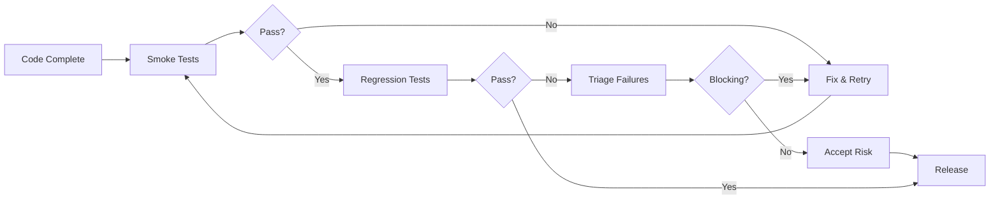

<Note>This page is under construction. More content coming soon!</Note>

## What is Regression Testing?

Regression testing ensures that new code changes haven't broken existing functionality. It's typically run before releases or after significant code changes.

<Tip>
While smoke tests verify "can we continue testing?", regression tests verify "are we ready to ship?"
</Tip>

## When to Run Regression Tests

<CardGroup cols={2}>
  <Card
    title="Before Release"
    icon="box"
  >
    Comprehensive validation before shipping to production
  </Card>

  <Card
    title="After Major Changes"
    icon="code-merge"
  >
    Verify large features or refactoring didn't break anything
  </Card>

  <Card
    title="Sprint End"
    icon="calendar-check"
  >
    Validate all sprint work before demo/release
  </Card>

  <Card
    title="After Hotfix"
    icon="fire-extinguisher"
  >
    Ensure hotfix didn't introduce new issues
  </Card>
</CardGroup>

## Building a Regression Suite

<Steps>
  <Step title="Start with Critical Tests">
    Include all smoke tests (P0/P1 critical paths)
  </Step>

  <Step title="Add Feature Coverage">
    Include tests for all major features:
    ```oql
    priority IN (p0, p1, p2) AND status = active
    ```
  </Step>

  <Step title="Add Historical Failures">
    Include tests that have failed before:
    ```oql
    failure_count > 0 AND status = active
    ORDER BY failure_count DESC
    ```
  </Step>

  <Step title="Tag Tests">
    Tag tests with `regression` for easy filtering:
    ```oql
    tags CONTAINS "regression" AND status = active
    ```
  </Step>

  <Step title="Balance Coverage vs Time">
    Target suite that completes in 2-4 hours maximum
  </Step>
</Steps>

## Regression Testing Strategy

<Tabs>
  <Tab title="Full Regression">
    ### Complete Test Suite

    Run all regression tests before major releases.

    **When to use:**
    - Major version releases
    - Quarterly releases
    - After significant architecture changes

    **Characteristics:**
    - 100+ tests
    - 2-4 hours execution time
    - All features covered
    - All priority levels (P0-P3)

    <Warning>
    Full regression is time-consuming. Reserve for major releases only.
    </Warning>
  </Tab>

  <Tab title="Selective Regression">
    ### Risk-Based Testing

    Test only areas affected by recent changes.

    **When to use:**
    - Sprint releases
    - Minor version updates
    - Targeted hotfixes

    **Strategy:**
    ```oql
    # Tests in affected components
    component IN (authentication, checkout) AND
    tags CONTAINS "regression" AND
    status = active
    ```

    **Benefits:**
    - Faster execution (30-60 minutes)
    - Focused on risk areas
    - More frequent testing possible
  </Tab>

  <Tab title="Automated Regression">
    ### Continuous Regression

    Automated tests run on every commit or nightly.

    **Setup:**
    - Automate all P0/P1 tests
    - Run on CI/CD pipeline
    - Integrate with version control
    - Alert team on failures

    **Benefits:**
    - Catch regressions early
    - Fast feedback loop
    - No manual effort required
    - Consistent execution
  </Tab>
</Tabs>

## Running Regression Tests

<Steps>
  <Step title="Select Test Suite">
    Choose appropriate regression level:

    ```oql
    # Full regression
    tags CONTAINS "regression" AND status = active
    ORDER BY priority ASC

    # Selective regression (e.g., auth module)
    tags CONTAINS "regression" AND
    component = "authentication" AND
    status = active
    ```
  </Step>

  <Step title="Create Test Run">
    Configure the test run:
    - **Name**: `Regression - v2.1.0 Release`
    - **Environment**: `Staging`
    - **Build**: `2.1.0-rc1`
    - **Assigned to**: Distribute among team
  </Step>

  <Step title="Execute Tests">
    Team executes assigned tests in parallel
  </Step>

  <Step title="Track Progress">
    Monitor run dashboard for:
    - Completion percentage
    - Pass/fail rate
    - Blockers
    - Failed tests needing triage
  </Step>

  <Step title="Triage Failures">
    For each failure:
    - Is it a real bug? Create defect.
    - Is it a test issue? Fix the test.
    - Is it environmental? Investigate environment.
  </Step>

  <Step title="Release Decision">
    Decide go/no-go based on results:
    - All P0 tests passed? ✅ Can release
    - Any P0 failures? ❌ Block release
    - P1/P2 failures? Assess risk
  </Step>
</Steps>

## Example Regression Suites

<AccordionGroup>
  <Accordion title="Web Application Regression" icon="window">
    **Scope:** Full website functionality

    **Categories:**
    - Authentication (10 tests)
    - Navigation (15 tests)
    - User Profile (12 tests)
    - Search (8 tests)
    - Content Management (20 tests)
    - Forms & Validation (18 tests)
    - Notifications (7 tests)
    - Settings (10 tests)

    **Total:** ~100 tests
    **Time:** ~3 hours
    **Tags:** `regression`, `web`
  </Accordion>

  <Accordion title="API Regression" icon="code">
    **Scope:** All API endpoints

    **Categories:**
    - Authentication endpoints (5 tests)
    - User CRUD operations (12 tests)
    - Product endpoints (15 tests)
    - Order processing (10 tests)
    - Search & filtering (8 tests)
    - File uploads (6 tests)
    - Webhooks (5 tests)

    **Total:** ~60 tests
    **Time:** ~45 minutes (automated)
    **Tags:** `regression`, `api`, `automated`
  </Accordion>

  <Accordion title="Mobile App Regression" icon="mobile">
    **Scope:** iOS & Android apps

    **Categories (per platform):**
    - App launch & onboarding (5 tests)
    - Login & authentication (8 tests)
    - Main navigation (10 tests)
    - Core features (25 tests)
    - Settings & preferences (7 tests)
    - Offline functionality (10 tests)
    - Push notifications (5 tests)

    **Total:** ~70 tests per platform
    **Time:** ~2 hours per platform
    **Tags:** `regression`, `mobile`, `ios`/`android`
  </Accordion>
</AccordionGroup>

## Optimizing Regression Testing

<CardGroup cols={2}>
  <Card
    title="Prioritize by Risk"
    icon="exclamation-triangle"
  >
    Test high-risk, frequently-changed areas first
  </Card>

  <Card
    title="Automate Stable Tests"
    icon="robot"
  >
    Move stable, repetitive tests to automation
  </Card>

  <Card
    title="Parallelize Execution"
    icon="arrows-split-up-and-left"
  >
    Distribute tests across team members
  </Card>

  <Card
    title="Remove Obsolete Tests"
    icon="trash"
  >
    Archive tests for deprecated features
  </Card>

  <Card
    title="Maintain Test Quality"
    icon="wrench"
  >
    Fix flaky tests immediately
  </Card>

  <Card
    title="Track Trends"
    icon="chart-line"
  >
    Monitor pass rates and execution times
  </Card>
</CardGroup>

## Regression Test Maintenance

<AccordionGroup>
  <Accordion title="Adding New Tests" icon="plus">
    When to add tests to regression suite:
    - New feature released
    - Bug found in production
    - Area lacking coverage
    - High-value user workflow

    **Process:**
    1. Create test case
    2. Execute to validate it works
    3. Tag with `regression`
    4. Add to appropriate folder
  </Accordion>

  <Accordion title="Removing Tests" icon="minus">
    When to remove tests from regression suite:
    - Feature deprecated/removed
    - Test is consistently flaky
    - Test is redundant with other tests
    - Feature changed significantly

    **Process:**
    1. Change status to `archived` (don't delete)
    2. Remove `regression` tag
    3. Document why it was removed
  </Accordion>

  <Accordion title="Updating Tests" icon="pen">
    Keep tests current with product changes:
    - Review test suite quarterly
    - Update after major feature changes
    - Fix broken tests immediately
    - Refine test steps for clarity
    - Update expected results

    <Tip>
    Assign test ownership to feature teams for ongoing maintenance
    </Tip>
  </Accordion>
</AccordionGroup>

## Integration with Release Process



## What's Next?

<CardGroup cols={2}>
  <Card
    title="Smoke Tests"
    icon="fire"
    href="/workflows/smoke-tests"
  >
    Quick verification tests
  </Card>

  <Card
    title="Organizing Tests"
    icon="folder-tree"
    href="/workflows/organizing-tests"
  >
    Structure your test suite
  </Card>

  <Card
    title="Team Collaboration"
    icon="users"
    href="/workflows/team-collaboration"
  >
    Work together on testing
  </Card>

  <Card
    title="Best Practices"
    icon="star"
    href="/resources/best-practices"
  >
    Testing best practices
  </Card>
</CardGroup>
